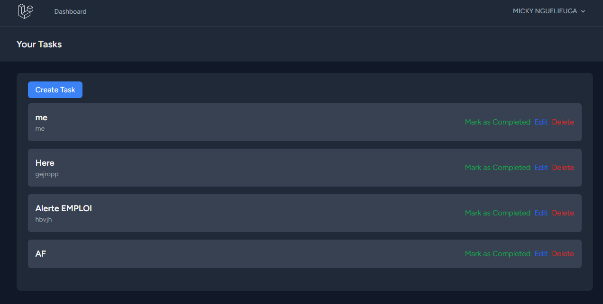

# Task Management Application

Cette application est un gestionnaire de tâches permettant aux utilisateurs de créer, modifier, marquer comme terminées et supprimer leurs propres tâches. Elle propose également un tableau de bord statistique, avec des interfaces pour le CRUD (Create, Read, Update, Delete) des tâches.

## Prérequis

Avant de commencer, assurez-vous d'avoir les éléments suivants installés sur votre machine :

-   PHP 8.3 ou supérieur
-   Composer
-   MySQL ou toute autre base de données compatible avec Laravel
-   Node.js et NPM (pour la gestion des dépendances front-end et la compilation des assets)
-   Un serveur web (Apache, Nginx ou Laravel Sail pour un environnement de développement) de preference laragon
-   Laravel 11

## Étapes d'installation

### 1. Cloner le dépôt

Commencez par cloner le dépôt Git de l'application :

```bash
git clone https://github.com/MICKYLE237/TodoListApp
cd votre-repertoire ou vous avez clonez
```

### 2. Installer les dépendances PHP

Installez les dépendances PHP à l'aide de Composer :

```bash
composer install
```

### 3. Configurer l'environnement

Dupliquez le fichier .env.example et renommez-le en .env :

```bash
cp .env.example .env
```

Modifiez ensuite les paramètres de connexion à la base de données dans le fichier .env :

```bash

DB_CONNECTION=mysql
DB_HOST=127.0.0.1
DB_PORT=3306
DB_DATABASE=nom_de_votre_base_de_données
DB_USERNAME=nom_d_utilisateur
DB_PASSWORD=mot_de_passe
```

### 4. Générer la clé d'application

Générez une clé unique pour l'application avec la commande suivante :

```bash

php artisan key:generate
```

### 5. Exécuter les migrations

Créez les tables nécessaires en exécutant les migrations :

```bash

php artisan migrate
```

### 6. Installer les dépendances front-end

Installez les dépendances front-end via NPM :

```bash

npm install
npm run dev
```

### 7. Lancer le serveur local

Enfin, lancez le serveur de développement Laravel avec :

```bash

php artisan serve
L'application sera accessible à l'adresse suivante : http://localhost:8000.
```

# Choix techniques

## Backend

Framework : Laravel (PHP), choisi pour sa facilité de gestion des opérations CRUD, ses fonctionnalités de sécurité (authentification, autorisations) et sa flexibilité avec Eloquent ORM.
Base de données : MySQL, pour la gestion efficace des données relationnelles.
Authentification : Système d'authentification Laravel, avec gestion des utilisateurs et rôles.
Frontend
Vue.js : Utilisé pour une interface utilisateur réactive, surtout pour les interactions complexes.
Tailwind CSS : Framework CSS pour un design moderne, épuré et mobile-first.
Blade Templates : Système de templating natif de Laravel, utilisé pour la gestion des vues avec un rendu rapide et intégré.
Pagination et gestion des tâches
Les tâches sont paginées avec paginate() pour éviter de surcharger la vue en affichant trop d'éléments à la fois.
L'utilisateur ne peut voir que ses propres tâches, grâce à des policies Laravel qui gèrent les autorisations de modification/suppression.
Les tâches terminées sont visuellement distinctes, avec des options pour les marquer comme terminées ou non.
Tests
Des tests unitaires et d'intégration peuvent être ajoutés pour valider la création, la mise à jour et la suppression des tâches.
Sécurité
Protection CSRF incluse nativement dans Laravel pour sécuriser les formulaires.
Système d'autorisation via Policies pour que les utilisateurs ne puissent gérer que leurs propres tâches.

NB : The database is situated in data.sql file
